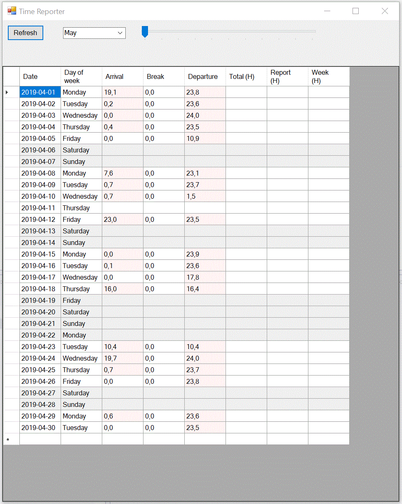
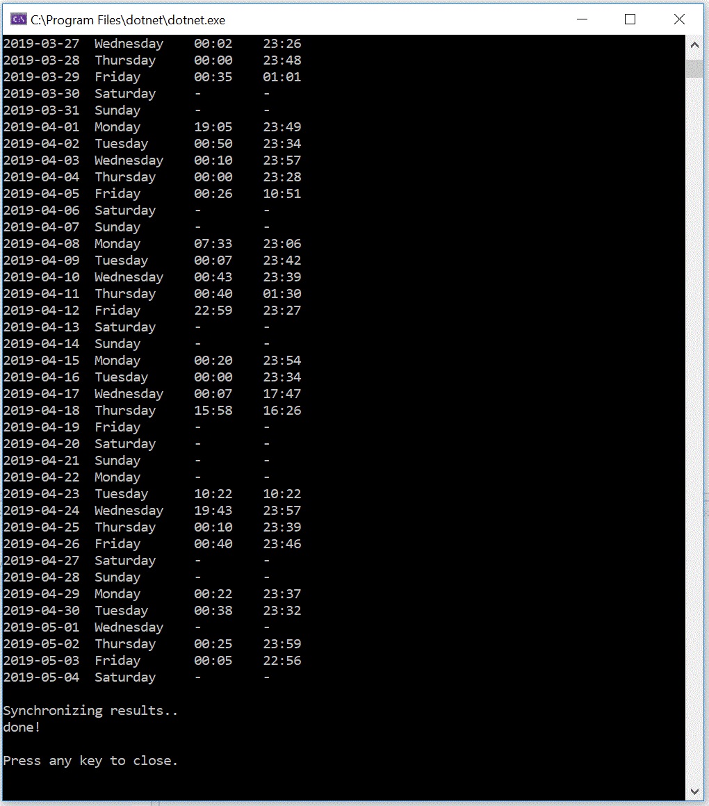

# TimeReporter

A systray time reporter. More info coming in a while.. Sometime. Intended as an example of the following concepts in near-future :)
* Rich-interface system tray application for Windows 10. 
* Proof-of-concept [DPI-aware](https://stackoverflow.com/questions/4075802/creating-a-dpi-aware-application) WinForms client. Have a look [here](http://crsouza.com/2015/04/13/how-to-fix-blurry-windows-forms-windows-in-high-dpi-settings/) too..
* [DotNetCore and DotNetFramework combination](https://docs.microsoft.com/en-us/dotnet/core/porting/project-structure).
* And interop with [CDP](https://github.com/cyrus-and/chrome-remote-interface) for headless tasks.
* Niché (highly specialized) event store using vacuuming and [time partitioning](https://dzone.com/articles/five-sharding-data-models-and-which-is-right) rather than for instance snapshotting.
* [Math.Compute](https://stackoverflow.com/questions/3972854/parse-math-expression) or similar technique for string parsing compute. 

## Building is pretty much standard as-per current documentations

```pwsh
Set-Location .\Timereporter.EventLogTask
dotnet publish -r win10-x64
Set-Location .\bin\Debug\netcoreapp2.1\
7z a Timereporter.EventLogTask.win10-x64.zip .\win10-x64\
```

### Winforms client


### Console client


Microsoft docs on building and publishing:
- [dotnet-publish](https://docs.microsoft.com/en-us/dotnet/core/tools/dotnet-publish?tabs=netcore21)
- [Os and arch designation](https://docs.microsoft.com/en-us/dotnet/core/rid-catalog)

## Example output

```cmd
..........................done!

DATE          DAY OF WEEK   ARRIVAL       LEAVE

2019-04-15    Monday        00:20         23:54
2019-04-16    Tuesday       00:00         23:34
2019-04-17    Wednesday     00:07         17:47
2019-04-18    Thursday      15:58         16:26
2019-04-19    Friday        -             -
2019-04-20    Saturday      -             -
2019-04-21    Sunday        -             -
2019-04-22    Monday        -             -
2019-04-23    Tuesday       10:22         10:22
2019-04-24    Wednesday     19:43         23:57
2019-04-25    Thursday      00:10         23:39
2019-04-26    Friday        00:40         23:46
2019-04-27    Saturday      -             -
2019-04-28    Sunday        -             -
2019-04-29    Monday        00:22         23:37
2019-04-30    Tuesday       00:38         02:40

Press any key to close.
```

## Links 

### Nodatime and local datetime-handling

- https://nodatime.org/2.3.x/userguide/type-choices
- https://stackoverflow.com/questions/21029489/getting-the-systems-localdatetime-in-noda-time
- https://cmikavac.net/2018/04/05/converting-to-and-from-local-time-in-c-net-with-noda-time/
- https://nodatime.org/1.4.x/api/NodaTime.LocalDateTime.html
